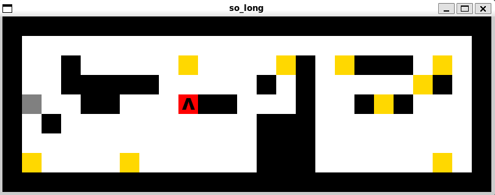

# so_long

This project is a very small 2D game. It is built to make you work with textures, sprites. And some very basic gameplay elements.

<div align="center"></div>

## Instruction

```
$ make                                      // for making mandatory part of game.
$ make clean                                // clear Obj files.
$ make fclean                               // clear all
$ ./so_long ./maps/map.ber
```

## Game

- The game we choose must follow a set of rules. The executable `so_long` will receive a map as the only argument, and this map will have a `.ber` filetype.
- Use W, A, S, D for moving
- You should collect all coins, after that door is opening and you can finish the game.
- Only `P` _(player)_, `1` _(wall)_, `0` _(empty)_, `C` _(collectible)_, and `E` _(exit)_ will be accepted characters in our map (except if you add enemies as bonus)
- The map must be rectangular, i.e. all rows must have the same length
- There must be at least one exit, one player, and one collectible on the map
- The map must be closed, i.e. surrounded by walls
- If any of these checks fail, the game must end with `ERROR\n` followed by a custom message.
- The goal is for the player(s) to collect all the collectibles on the map before going to an exit in the least possible number of steps
- For the graphics part of the project we used a library called `minilibx`. It's fairly basic and somewhat limited, but was still fun to use in the project.
